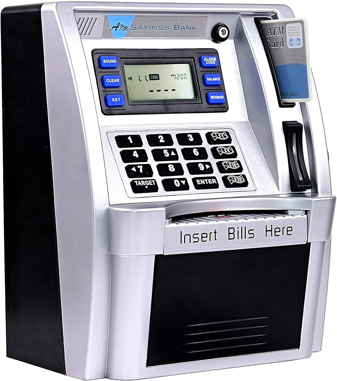
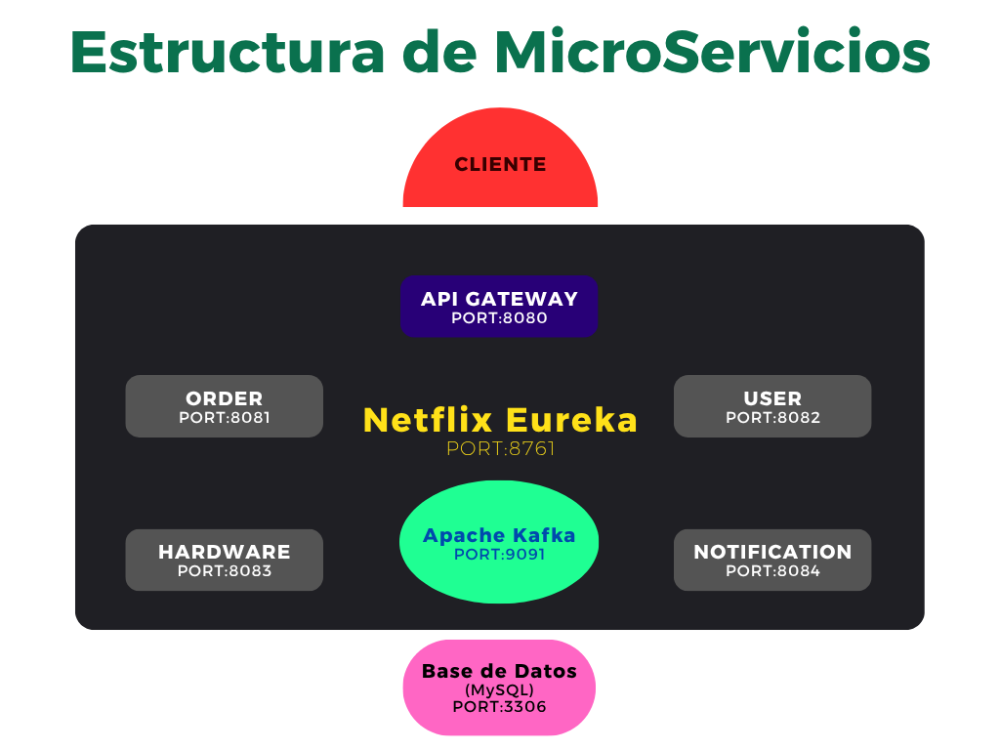

# 🏧 BankATM_Microservicios

> El proyecto representa un Cajero Autómatico Bancario, en donde, 
> se pueden realizar funciones tales como Ingresos y Retiros de Dinero,
> Operaciones de Transferencia Bancaria, Pago con Bizum, Registro de Usuarios,
> Creación de Órdenes, Mostrar Datos en Pantalla, Actualizar la Base de Datos, Etc.

  

## 🎪 Características
- **Característica 1:** Operaciones API (Application Programming Interface).
- **Característica 2:** Autenticación de Usuarios Rápida y Segura mediante OAuth2 (Google).
- **Característica 3:** Estructura de Microservicios orquestada por Netflix Eureka.
- **Característica 4:** Recepción y Enrutamiento de Solicitudes mediante API Gateway.
- **Característica 5:** Comunicación Asíncrona mediante Apache Kafka.
- **Característica 6:** Comunicación Síncrona mediante OpenFeign.
- **Característica 7:** Conexión a Base de Datos (MySQL).
- **Característica 8:** Empaquetamiento de Aplicaciones en Contenedores Virtuales mediante Docker.

## 🛠️ Tecnologías Utilizadas
- **Lenguaje:** Java (21-LTS)
- **Framework:** Spring
- **Base de Datos:** MySQL
- **Transmisión de Eventeos:** Apache Kafka
- **Contenerización:** Docker
- **Control de Versiones:** Git

## 📦 Instalación y Puesta en Marcha

Cabe aclarar que el proyecto principal es la integración de una 
serie de servicios e aplicaciones internas.
Así, el proyecto se puede desplegar de dos maneras:
   - Arrancando cada una de las Aplicaciones Internas de Java en tu Editor de 
Código  o Terminal (No Recomendado, ya que debes de tener todo el Software
necesario instalado en tu Sistema Operativo)
   - Utilizando Docker para poner en marcha el proyecto completo  (Recomendado, simplemente
debes tener Docker Instalado)

### Pasos a Seguir para la Instalación con Docker

**1. Clonar el repositorio:** `git clone`  
**2. Arranque el Docker Daemon** Abre la aplicación de Docker Desktop   
**3. Sitúate en la Carpeta Raíz del Proyecto:** Aquí debe aparecer el archivo `docker-compose.yml`  
**4. Crea e Inicia los Contenedores Docker:** Utilizando el comando `docker compose up`

## 🏢 Estructura de Microservicios

  

## 👁️‍🗨️ Prueba la Aplicación

Primeramente debes de Autenticarte en la Aplicación mediante tu 
Cuenta de Google.
La aplicación utiliza únicamente la verificación por el servicio OAuth2 
de Google como forma de autenticación (OAuth2 Resource Server).

Para probar la aplicación, puedes utilizar las siguientes llamadas HTTP:
- **Obtener Lista de Usuarios:** (GET) `http://localhost:8080/user`
- **Obtener Lista de Ordenes:** (GET) `http://localhost:8080/order`
- **Crear un Usuario (Introduce el Usuario en el Cuerpo de la Solicitud):** (POST) `http://localhost:8080/user`
- **Obtener Lista de Usuarios:** (GET) `http://localhost:8080/user`
- **Ingresa Dinero (Introduce la Cantidad Económica en el Cuerpo de la Solicitud):** (PUT) `http://localhost:8080/user`
- **Crea una Orden en la Lista:** (POST) `http://localhost:8080/order`
- **Borra una Orden de la Lista (Introduce el ID al final de la Ruta como una Variable):** (DELETE) `http://localhost:8080/order/id`
- **Procesa una Orden (Introduce la Orden en el Cuerpo de la Solicitud):** (POST) `http://localhost:8080/order/process`
  
Es recomendable que tras las Operaciones Modificantes, verifique que los datos han sido actualizados correctamente.  
Tambien es recomendable verificar si ha recibido un correo electrónico en su cuenta tras ciertas 
operaciones como crear un Usuario, crear una Orden o Procesar una Orden. 

## ⚙️ Mejoras Futuras

Próximamente, espero añadir una serie de grandes características en el Proyecto

- Desplegar el Proyecto en la Web (Cloud - AWS)☁️
- Integrar una Herramienta de Terminal basada en IA (Agente) para ayudar tanto en futuros desarrollos como en la mantenibilidad del Proyecto (OpenCode o ClaudeCode) 🕵️‍♂️
- Desarrollar el FrontEnd de la App para incluir una Interfaz de Usuario amigable y simple de usar (TypeScript plus React or Angular) 💻
- Implementar la Orquestación y Gestión de mis Microservicios Contenerizados con Docker (Kubernetes) 🎹🎻

Después de implementar estos 4 proyectos principales, supongo que seguiré aprendiendo otras diferentes herramientas de software o profundizaré más mis conocimientos en las que ya conozco. 

